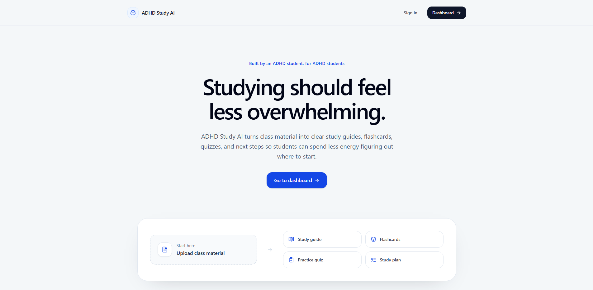
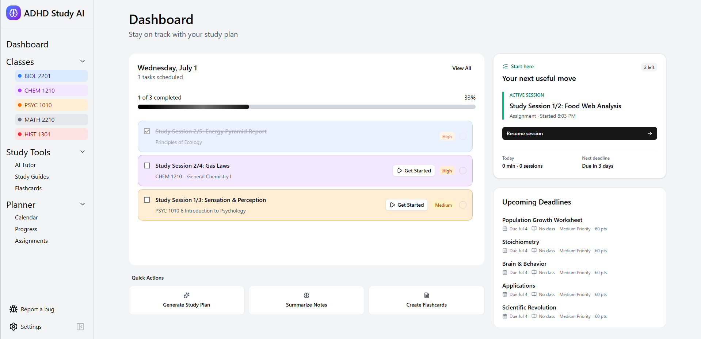
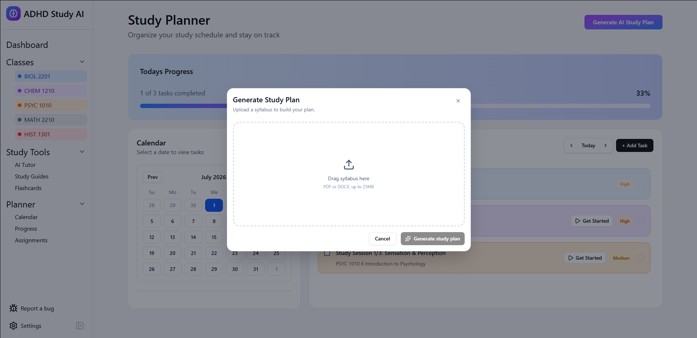
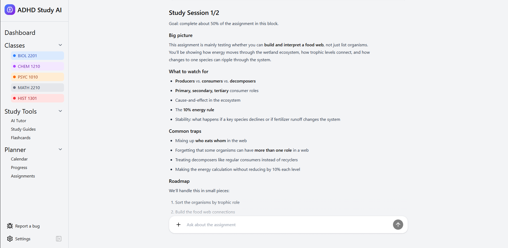
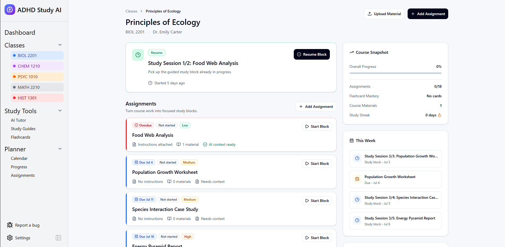
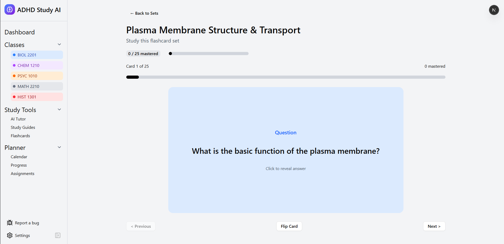

# ADHD Study AI

**An ADHD-friendly study planning and tutoring app that turns class materials into clear next steps.**

ADHD Study AI is a full-stack web app built to help students reduce overwhelm, understand what to work on next, and study with AI support that is grounded in their actual coursework. Students can upload syllabi, assignments, notes, readings, and study materials, then use the app to generate study plans, study guides, flashcards, and guided focus sessions.

> Built by a software engineering student with ADHD to help students turn overwhelming coursework into clear, manageable study steps.

**Live Demo:** [ADHDStudyAI.com](https://adhdstudyai.com)  
**Deployment:** Deployed on Vercel

---

## Table of Contents

- [Why I Built This](#why-i-built-this)
- [Product Overview](#product-overview)
- [Core Features](#core-features)
- [ADHD-Focused Design Decisions](#adhd-focused-design-decisions)
- [Tech Stack](#tech-stack)
- [Architecture Highlights](#architecture-highlights)
- [Screenshots](#screenshots)
- [Getting Started](#getting-started)
- [Environment Variables](#environment-variables)
- [Build and Checks](#build-and-checks)
- [Project Status](#project-status)
- [What This Project Demonstrates](#what-this-project-demonstrates)

---

## Why I Built This

As a student with ADHD, I know that the hardest part of studying is not always the material itself. A lot of the time, the hardest part is figuring out where to start.

Students with ADHD can have the syllabus, the assignment, the textbook, the notes, and the deadline in front of them and still feel stuck because the task is too large and too unclear. Traditional planners often assume the student already knows how to break the work down. Traditional AI tools can explain topics, but they usually are not aware of the student's actual class, deadlines, uploaded materials, or current task.

I built ADHD Study AI to solve that gap.

The goal is not to replace studying. The goal is to protect the momentum it takes to start.

When you have ADHD and finally feel ready to focus, you do not want to spend that energy answering a dozen setup questions before you can begin. What do I need to work on today? What is the next step? What does this assignment actually require? Which study material is relevant to what I am working on? What can I do right now without getting overwhelmed?

ADHD Study AI is built to answer those questions faster, so students can move from intention to action while their focus is still there.

This project is very personal to me because it reflects the kind of tool I wish I had while trying to balance coursework, maintaining focus, deadlines, and the executive dysfunction that can come with ADHD.

---

## Product Overview

ADHD Study AI combines a study planner, AI tutor, file-aware assignment assistant, flashcard generator, study guide generator, and class dashboard into one focused workspace.

Instead of giving students another blank productivity app, ADHD Study AI uses uploaded course context to create a more guided workflow:

1. Upload a syllabus, assignment, or study material.
2. Let AI extract the important information.
3. Review the AI output before saving it.
4. Turn coursework into assignments, study blocks, flashcards, or study guides.
5. Start a focused session with an AI tutor that understands the assignment context.

---

## Core Features

### ADHD-Friendly Dashboard

The dashboard is designed around the question: **"What should I do today?"**

It includes:

- Today's scheduled study tasks
- Upcoming deadlines
- Daily study progress
- Study minutes and session counts
- Active study session awareness
- A clear entry point for generating an AI study plan

The goal is to reduce decision fatigue by making the next action obvious.

---

### AI Syllabus Import

Students can upload a syllabus and turn it into structured course data.

The syllabus importer can:

- Accept PDF and DOCX syllabus files
- Extract class information
- Detect assignments, exams, quizzes, projects, and due dates
- Estimate assignment importance and difficulty
- Let the user review the extracted results before saving
- Match the syllabus to an existing class or create a new class
- Generate balanced study plan tasks from the extracted deadlines
- Limit the number of generated tasks per day to avoid overload

This turns a long syllabus into a practical study schedule.

---

### Planner and Calendar

The planner gives students a structured way to manage coursework without turning the app into a complicated project management system.

Current planner features include:

- Manual study task creation
- AI-generated study plan tasks
- Daily task lists
- Calendar view
- Assignment deadline visibility
- Task completion toggles
- Priority and estimated-minute tracking
- Active study session integration

The calendar gives a visual overview of upcoming work while the daily planner keeps the focus on one day at a time.

---

### Class Workspaces

Each class has its own workspace so students can keep assignments, study materials, and flashcards organized by course.

A class workspace includes:

- "Next Up" card for the most relevant upcoming work
- Assignments for that class
- Uploaded class materials
- Flashcard sets connected to the class
- Course snapshot with progress, assignment status, material count, flashcard mastery, and study streak data
- This-week overview
- Quick actions for creating assignments, uploading materials, generating flashcards, and starting study sessions

This gives every course a central hub instead of scattering materials across different tools.

---

### Assignment Uploads and Study Materials

Students can upload assignment instructions and supporting study materials so the AI tutor can respond with better context.

The app supports:

- Assignment instruction files
- Supporting study materials
- PDF, DOCX, TXT, MD, CSV, and JSON study files
- File text extraction
- Assignment material storage
- Matching uploaded materials to existing assignments
- Creating new assignment records from uploaded files
- Context versioning so future study blocks can be refined when assignment details change

This is one of the most important parts of the project because it keeps the AI from guessing based only on an assignment title.

---

### AI Material Classification

When students upload class files, the app can analyze them and decide whether they look like:

- Assignment instructions
- Study materials
- General class resources

The AI can also suggest whether a file should be matched to an existing assignment or used to create a new one. The user reviews this before saving, which keeps the workflow controlled and avoids silent AI mistakes.

---

### Guided Study Sessions

Guided study sessions turn assignments into focused work blocks.

A session can include:

- A timer
- Assignment context
- Uploaded assignment instructions
- Related study materials
- AI tutor messages saved to the session
- Completion tracking
- Task completion updates
- Assignment completion updates

The tutor is designed to guide the student through the work instead of simply doing the assignment for them. It can ask questions, give hints, explain relevant concepts, and help the student make progress one step at a time.

---

### Context-Aware AI Tutor

The AI tutor is designed for focused learning support.

Tutor features include:

- Streaming chat responses
- File attachment support
- Multi-file context handling
- Markdown rendering
- Math rendering with KaTeX-compatible formatting
- Assignment-aware tutoring inside guided sessions
- Clear behavior when there is not enough context
- Prompt-injection-resistant handling of uploaded file text

Instead of pretending to know what the student needs, the tutor can use uploaded files as source material and ask for context when the assignment is unclear.

---

### AI Study Guide Generator

Students can upload study materials and generate structured study guides.

Generated guides can include:

- Quick summaries
- Key concepts
- Vocabulary
- Step-by-step explanations
- Common mistakes
- Practice questions
- Estimated study plans

The study guide output is formatted for readability with short sections, clear headings, and markdown support.

---

### Flashcards

The flashcard system supports both manual creation and AI-generated cards.

Flashcard features include:

- Create flashcard sets manually
- Generate flashcards from uploaded files
- Choose the number of generated cards
- Preview and edit generated flashcards before saving
- Save cards to Supabase
- Connect flashcard sets to classes
- Review flashcards with a flip-card interface
- Render markdown and math inside cards
- Delete flashcard sets

This gives students a fast way to turn dense material into active recall practice.

---

### Authentication and User-Owned Data

The app uses Supabase authentication and user-scoped data so each student has their own private workspace.

Implemented persistence includes:

- Classes
- Assignments
- Study tasks
- Study sessions
- Study session messages
- Flashcard sets
- Flashcards
- Uploaded assignment and study material metadata

---

## ADHD-Focused Design Decisions

This project is intentionally designed around ADHD pain points rather than generic productivity advice.

### 1. One obvious next action

The app tries to avoid making the student decide between too many options at once. Dashboards, class pages, and study sessions are built around surfacing the next useful step.

### 2. Review before saving AI output

AI-generated plans, syllabus imports, flashcards, and file classifications are designed to be reviewed before they become part of the user's workspace. This keeps the user in control while still reducing manual work.

### 3. Break large assignments into smaller sessions

Instead of estimating one giant completion time and overwhelming the student, the app can create smaller study blocks tied to actual assignments and deadlines.

### 4. Context over guessing

A major goal of the project is to stop the AI from making up generic steps. The tutor works best when it has the actual assignment file and study materials, and the UI encourages the student to upload that context.

### 5. Calm, readable interface

The UI favors short sections, clear labels, predictable actions, and minimal clutter. The goal is to make studying feel more approachable, especially when the student is already overwhelmed.

---

## Tech Stack

### Frontend

- Next.js App Router
- React
- TypeScript
- Tailwind CSS
- shadcn/ui-style components
- Lucide React icons
- React Markdown
- KaTeX-compatible math rendering

### Backend

- Next.js API routes
- Supabase Auth
- Supabase Postgres
- Supabase Storage
- Row-level-security-style user data isolation

### AI

- OpenAI API
- Streaming tutor responses
- Structured AI outputs for syllabus parsing and file classification
- AI-generated study guides
- AI-generated flashcards
- Assignment-aware guided tutoring

### File Processing

- PDF text extraction
- DOCX text extraction
- Plain text and markdown handling
- CSV and JSON study material support
- Upload limits and validation for safer file handling

---

## Architecture Highlights

### Syllabus-to-plan workflow

```text
Upload syllabus
   ->
Extract file text
   ->
AI analyzes course + assignments
   ->
User reviews results
   ->
Create or match class
   ->
Create assignments
   ->
Generate study plan tasks
   ->
Show tasks in planner, dashboard, and calendar
```

### Assignment-aware study session workflow

```text
Select assignment or study task
   ->
Start guided study session
   ->
Load assignment instructions + materials
   ->
AI tutor guides the student step-by-step
   ->
Session messages and timer are saved
   ->
Student completes or cancels session
   ->
Task and assignment status can be updated
```

### File-aware AI workflow

```text
Upload class files
   ->
Extract text
   ->
AI classifies file purpose
   ->
AI suggests assignment match or new assignment
   ->
User reviews before saving
   ->
Material becomes available to tutor and study sessions
```

---

## Screenshots

The screenshots below are stored in `docs/screenshots/` so they render directly on GitHub.

### Landing Page

The landing page explains the core value proposition clearly: ADHD Study AI turns class material into study guides, flashcards, quizzes, and next steps so students spend less energy figuring out where to start.



### Dashboard

The dashboard focuses on the student's next useful move. It shows today's scheduled work, progress, an active session card, quick actions, and upcoming deadlines in one place.



### AI Study Plan Generation

Students can upload a syllabus and generate a structured study plan instead of manually copying deadlines into a calendar.



### Guided Study Session

Guided sessions break assignments into smaller blocks and give the student a clear roadmap, common traps, and an assignment-aware AI tutor input.



### Class Workspace

Each class has a dedicated workspace for assignments, uploaded materials, progress, weekly work, and resumable study blocks.



### Flashcard Review

The flashcard review interface supports active recall with progress tracking, card flipping, and mastery counts.



---

## Getting Started

### 1. Clone the repository

```bash
git clone <your-repo-url>
cd adhd-study-ai
```

### 2. Install dependencies

```bash
npm install
```

### 3. Configure environment variables

Create a `.env.local` file and add the required values.

```bash
NEXT_PUBLIC_SUPABASE_URL=
NEXT_PUBLIC_SUPABASE_ANON_KEY=
OPENAI_API_KEY=
```

Depending on your local setup, you may also need any Supabase service keys, site URLs, or model configuration variables used by your deployment.

### 4. Set up Supabase

Apply the SQL migrations in `supabase/migrations/` to your Supabase project and create a private storage bucket named `assignment-files` for assignment and study material uploads.

The app expects Supabase-backed persistence for:

- Authenticated users
- Classes
- Assignments
- Study tasks
- Study sessions
- Session messages
- Flashcards
- Uploaded assignment files and study materials

### 5. Run the development server

```bash
npm run dev
```

Open the local app in your browser and sign up or log in to begin testing the full workflow.

---

## Environment Variables

| Variable | Purpose |
| --- | --- |
| `NEXT_PUBLIC_SUPABASE_URL` | Supabase project URL used by the client and server |
| `NEXT_PUBLIC_SUPABASE_ANON_KEY` | Public Supabase anon key for authenticated client access |
| `OPENAI_API_KEY` | OpenAI API key used by AI routes |
| Additional Supabase/server variables | Used as needed for server-side storage, auth, or deployment configuration |

---

## Build and Checks

Before sharing or deploying changes, run:

```bash
npm run lint
npm run test:scheduling
npm run build
```

These commands check formatting/lint rules, verify the syllabus scheduling logic, and confirm the production Next.js build.

---

## Project Status

### Implemented

- Authentication
- Class management
- Assignment tracking
- Syllabus upload and AI extraction
- AI-generated study plans
- Planner and calendar views
- Assignment file uploads
- Study material uploads
- AI file classification
- Guided study sessions
- Context-aware AI tutor
- AI study guide generation
- AI flashcard generation
- Manual flashcard creation
- Flashcard review interface
- Supabase-backed persistence

### In Progress / Planned

- Full practice quiz generator
- Reading time estimator
- Standalone assignment breakdown tool
- Dedicated distraction-free study mode
- More detailed progress analytics
- Settings page polish
- Bug report workflow polish
- Production-ready screenshot/demo documentation

---

## What This Project Demonstrates

This project demonstrates more than a simple AI wrapper. It shows full-stack product thinking across user experience, data modeling, AI integration, and real student workflows.

Key engineering areas demonstrated:

- Full-stack Next.js development
- Authenticated user flows
- Supabase database integration
- File upload and storage workflows
- AI API integration
- Streaming AI responses
- Structured AI outputs with validation
- PDF and DOCX text extraction
- CRUD interfaces
- Calendar and planner UI
- User-owned data modeling
- ADHD-conscious UX design
- Portfolio-ready product polish

---

## Personal Note

ADHD Study AI started as a portfolio project, but the idea is rooted in a real problem: students with ADHD often do not need more pressure, more clutter, or another blank planner. They need help turning messy academic responsibilities into small, clear, doable steps.

That is the product philosophy behind this app:

**Make the next step clear enough that starting feels possible.**
