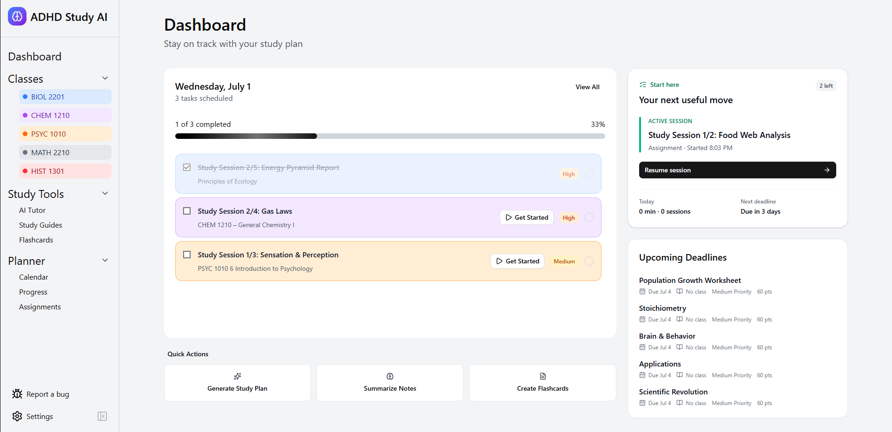
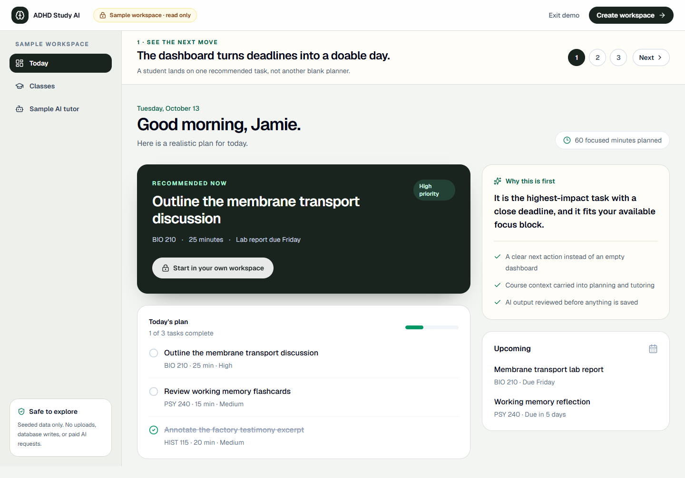
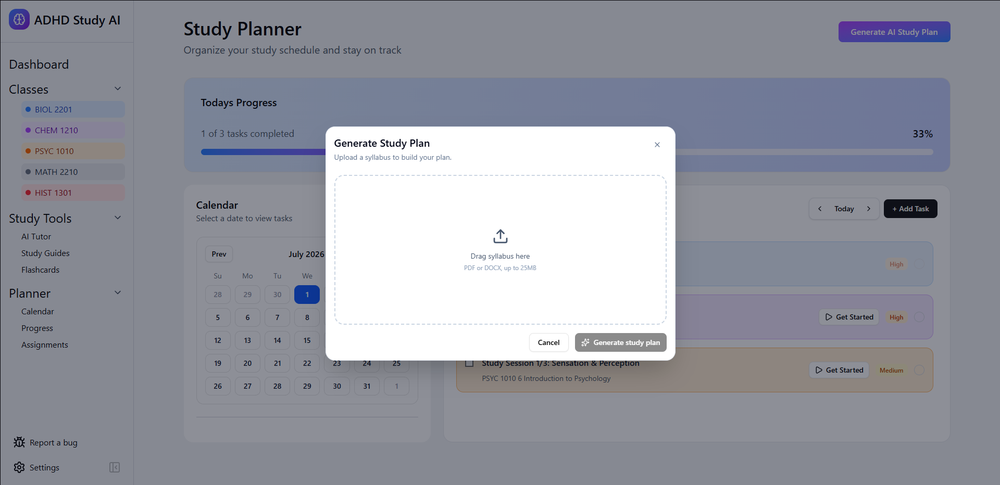
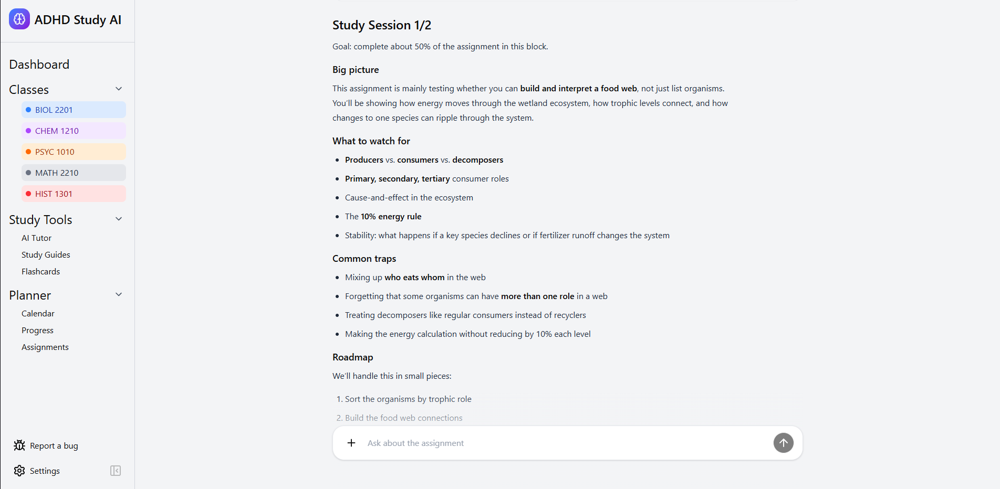
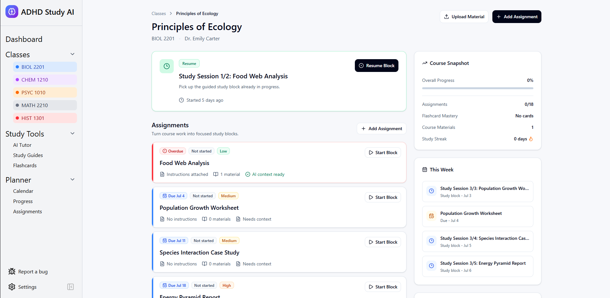
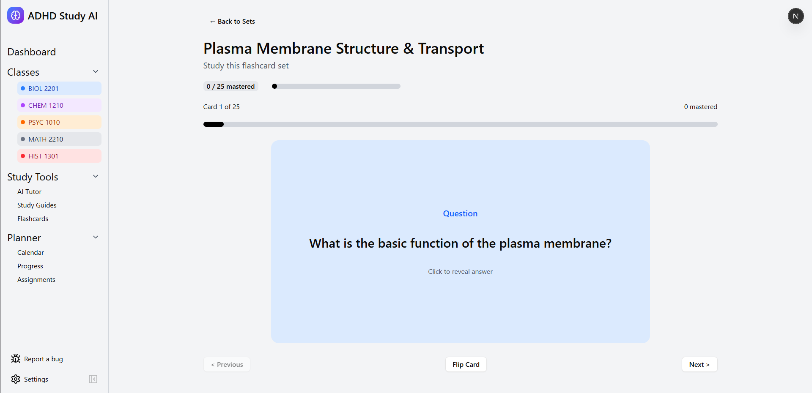

# ADHD Study AI

An ADHD-friendly study workspace that turns course material into clear, manageable next steps.

[Live app](https://adhdstudyai.com) · [Explore the read-only demo](https://adhdstudyai.com/demo)



ADHD Study AI brings planning, course organization, AI tutoring, study guides, flashcards, and focused work sessions into one workspace. Students can upload a syllabus or assignment, review the information extracted by AI, and turn it into work they can act on without rebuilding their academic life in another complicated planner.

The product is built around a simple idea: when starting is the hard part, the interface should make the next useful action obvious.

## What the app does

### Turn a syllabus into a plan

- Upload a PDF or DOCX syllabus.
- Extract course details, assignments, exams, projects, and due dates with structured AI output.
- Review and edit the result before anything is saved.
- Match the syllabus to an existing class or create a new class.
- Generate balanced study tasks with a configurable daily limit.
- See the resulting work across the dashboard, planner, assignments view, and calendar.

### Organize each class in one workspace

- Track assignments, due dates, priority, status, and related tasks.
- Upload assignment instructions and supporting course material.
- Let AI classify new material and suggest an assignment match.
- Review every classification before saving it.
- See the next assignment, weekly work, recent study activity, materials, and flashcard sets together.

### Study with course context

- Start a timed guided session from a task or assignment.
- Give the tutor access to the relevant instructions and study material.
- Receive streaming, step-by-step help designed to guide rather than complete the work for the student.
- Save tutor messages and session progress.
- Refine future plan items when newly uploaded assignment context changes the scope of the work.
- Mark the study task or assignment complete from the session flow.

### Create reusable study material

- Generate structured study guides from uploaded files and keep them in a persistent library.
- Generate flashcards, choose the card count, edit the result, and save sets by class.
- Create flashcard sets manually.
- Review cards with progress and mastery tracking.
- Render Markdown and KaTeX-compatible math in tutor responses, guides, and flashcards.

### Keep the workspace useful day to day

- Dashboard centered on today's work, progress, upcoming deadlines, and active sessions.
- Daily planner, assignment list, calendar, and weekly progress view.
- User preferences for default focus length and break reminders.
- Privacy information, sign-out controls, and permanent account/data deletion.
- A bug-report form that prepares a reproducible GitHub issue without silently sending private study data.

## Try it without an account

The public [sample workspace](https://adhdstudyai.com/demo) mirrors the real product with seeded classes, assignments, tasks, study guides, flashcards, planner data, and locally scripted tutor interactions. It is deliberately read-only: account changes, uploads, writes, and paid AI requests are disabled.



## ADHD-focused product decisions

1. **One obvious next action.** Pages prioritize what is useful now instead of presenting every possible action at once.
2. **Review before save.** AI-generated syllabus data, plans, flashcards, and material classifications remain editable until the student confirms them.
3. **Smaller work blocks.** Large assignments become achievable sessions tied to real deadlines and course context.
4. **Context before guessing.** The tutor uses the student's files and clearly asks for more information when the source material is insufficient.
5. **Calm, consistent UI.** Short sections, predictable controls, responsive layouts, keyboard focus states, and reduced-motion support keep the interface approachable.
6. **Momentum survives navigation.** Active timers, session messages, saved guides, and study state persist so a student can resume instead of restarting.

## How the main workflow fits together

```text
Syllabus or course file
        |
        v
Text extraction + structured AI analysis
        |
        v
Student review and confirmation
        |
        +----------> Class + assignments
        |                    |
        |                    v
        +----------> Planner + calendar
                             |
                             v
                    Guided study session
                             |
                    +--------+---------+
                    |                  |
                    v                  v
                AI tutor       Guides + flashcards
```

The same ownership boundary runs through the full flow. Authenticated requests are resolved to a Supabase user, relationships are checked server-side, and row-level security keeps one user's classes, assignments, sessions, files, guides, and flashcards separate from another user's data.

## Screenshots

### Syllabus review and plan generation



### Guided study session



### Class workspace



### Flashcard review



## Tech stack

| Area | Technology |
| --- | --- |
| Web app | Next.js 16 App Router, React 19, TypeScript |
| UI | Tailwind CSS 4, Radix UI, shadcn-style components, Lucide icons |
| Data | Supabase Postgres, Auth, Storage, and row-level security |
| AI | OpenAI Responses API, streaming responses, Zod-validated structured output |
| Content | React Markdown, remark-math, rehype-katex, KaTeX |
| File parsing | pdf-parse and Mammoth |
| Testing | Vitest, Node test runner, Playwright, Supabase database tests, axe-core |
| Delivery | Vercel and GitHub Actions |

## File support

| Workflow | Accepted files |
| --- | --- |
| Syllabus import | PDF, DOCX |
| Assignment instructions | PDF, DOCX, TXT, MD |
| General study material | PDF, DOCX, TXT, MD, CSV, JSON |

Study-material uploads are limited to 25 MB. Tutor conversations accept up to five attachments, with server-side extraction and context limits to keep requests bounded.

## Security, privacy, and reliability

- Supabase row-level security and server-side relationship checks protect user-owned records.
- Private Storage policies isolate uploaded assignment files and study materials.
- AI endpoints require authentication and enforce request/usage protections.
- Uploaded text is treated as untrusted source material rather than as model instructions.
- A strict Content Security Policy and standard browser security headers are applied by Next.js.
- Optional monitoring sends redacted error events; Vercel Runtime Logs remain the default server sink.
- AI calls emit structured latency, token, status, and estimated-cost metrics.
- Account deletion removes private files and application data before deleting the auth user.
- The CI suite checks linting, types, unit/API behavior, coverage, database policies, builds, accessibility, browser journeys, resource isolation, upload boundaries, and tutor resilience.

See the in-app [privacy page](https://adhdstudyai.com/privacy) for the user-facing data policy.

## Local development

### Prerequisites

- Node.js 22
- npm
- Docker Desktop for the local Supabase stack and database/browser tests
- An OpenAI API key for live AI features and evaluations

### 1. Clone and install

```bash
git clone https://github.com/JasonTroup-dev/ADHD-Study-AI.git
cd ADHD-Study-AI
npm install
```

### 2. Start Supabase

```bash
npx supabase start
```

The local stack applies the migrations in `supabase/migrations/`, including the private `assignment-files` Storage bucket and its ownership policies. Run `npx supabase status` to view the local project URL and keys.

### 3. Configure the app

Create `.env.local` in the project root:

```dotenv
NEXT_PUBLIC_SUPABASE_URL=http://127.0.0.1:54321
NEXT_PUBLIC_SUPABASE_ANON_KEY=your-local-anon-key
OPENAI_API_KEY=your-openai-api-key
```

Use the values printed by the local Supabase CLI. Never expose a service-role or secret key through a `NEXT_PUBLIC_` variable.

### 4. Run the app

```bash
npm run dev
```

Open [http://localhost:3000](http://localhost:3000), create an account, and start with a class or syllabus import.

## Environment variables

| Variable | Required | Purpose |
| --- | --- | --- |
| `NEXT_PUBLIC_SUPABASE_URL` | Yes | Supabase project URL used by the client and server |
| `NEXT_PUBLIC_SUPABASE_ANON_KEY` | Yes | Public anon key used for authenticated Supabase access |
| `OPENAI_API_KEY` | For AI features | Server-only OpenAI API key |
| `NEXT_PUBLIC_SITE_URL` | No | Canonical site origin; defaults to `https://adhdstudyai.com` |
| `SUPABASE_SECRET_KEY` or `SUPABASE_SERVICE_ROLE_KEY` | For account deletion and billing | Server-only admin credential used by account deletion and verified Paddle webhooks |
| `PADDLE_ENVIRONMENT` | For billing | `sandbox` while testing; set to `production` when going live |
| `NEXT_PUBLIC_PADDLE_CLIENT_TOKEN` | For billing | Public Paddle.js token from Developer tools → Authentication |
| `PADDLE_API_KEY` | For billing | Server-only Paddle API key for transactions and portal sessions |
| `PADDLE_WEBHOOK_SECRET` | For billing | Server-only secret for the Paddle notification destination |
| `PADDLE_PRICE_ID` | For billing | Recurring Paddle price sold by the Pro checkout |
| `OPENAI_*_MODEL` | No | Per-workflow model overrides; see `lib/ai/runtime.ts` |
| `ERROR_MONITORING_ENDPOINT` | No | Webhook for redacted server error events |
| `ERROR_MONITORING_TOKEN` | No | Optional bearer token for the monitoring webhook |

Supported model override names are `OPENAI_ASSIGNMENT_GUIDE_MODEL`, `OPENAI_CLASS_MATERIAL_MODEL`, `OPENAI_FLASHCARDS_MODEL`, `OPENAI_STUDY_GUIDE_MODEL`, `OPENAI_STUDY_TUTOR_MODEL`, `OPENAI_TUTOR_MODEL`, and `OPENAI_SYLLABUS_MODEL`.

### Paddle sandbox setup

1. Under **Checkout → Checkout settings**, set the default payment link to your app's `/billing` URL. Sandbox accepts a localhost URL; live mode requires an approved domain.
2. In Paddle Sandbox, create a product and a recurring price. Copy the `pri_...` price ID to `PADDLE_PRICE_ID`.
3. Under **Developer tools → Authentication**, create a client-side token and an API key. Put them in `NEXT_PUBLIC_PADDLE_CLIENT_TOKEN` and `PADDLE_API_KEY`.
4. Under **Developer tools → Notifications**, add a destination pointing to `https://your-domain.example/api/paddle/webhook`. Subscribe it to all `subscription.*` events and copy its endpoint secret to `PADDLE_WEBHOOK_SECRET`.
5. Set `SUPABASE_SECRET_KEY` (or the legacy `SUPABASE_SERVICE_ROLE_KEY`) so the verified webhook can update billing state.
6. Apply the Supabase migrations, start the app, and open `/billing`. Use Paddle's sandbox card `4242 4242 4242 4242`, any future expiry, and security code `100`.

Sandbox and live Paddle catalogs and credentials are separate. When going live, replace every Paddle value with its live counterpart and change `PADDLE_ENVIRONMENT` to `production` in the same deployment.

## Quality checks

```bash
npm run lint
npm run typecheck
npm test
npm run eval:ai:validate
npm run build
```

Additional suites:

```bash
npm run test:coverage  # HTML/LCOV coverage with enforced thresholds
npm run test:db        # Supabase database and RLS tests
npm run test:e2e       # Playwright browser journeys
npm run eval:ai        # Live representative AI evaluations
```

`test:db` and `test:e2e` expect the local Supabase stack to be running. `eval:ai` makes real OpenAI requests; `eval:ai:validate` only validates the checked-in evaluation fixtures and does not call the API.

## AI evaluation and observability

AI defaults, timeouts, retry behavior, and model pricing live in `lib/ai/runtime.ts`. Each request writes a structured `ai.request` record containing the workflow, model, response status, latency, token usage, cached/reasoning tokens, and estimated standard-API cost. Unknown model overrides report a `null` cost instead of applying an incorrect rate.

The evaluation suite uses representative biology, psychology, and history fixtures. A live run emits one `ai.eval_case` record per case plus an `ai.eval_summary`, and exits nonzero when a case falls below the configured quality threshold.

## Project status

The core authenticated product and public read-only demo are implemented. Current work is focused on:

- completing practice-quiz generation and feedback after the new material-selection flow;
- assignment breakdown and reading-time utilities;
- a dedicated distraction-reduced study mode;
- deeper progress insights and continued accessibility/UI polish.

## Why I built it

As a student with ADHD, I know the hardest part of studying is often not the material itself. It is deciding where to begin while the syllabus, notes, assignment, deadline, and pressure all compete for attention.

Traditional planners assume the student already knows how to break work down. General-purpose AI can explain a topic, but it usually does not know the student's real class, uploaded material, deadline, or current task. ADHD Study AI is my attempt to close that gap. It uses the student's actual coursework to offer relevant support and make the next step clear enough that getting started feels possible.
